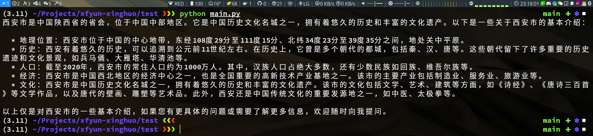

# 讯飞星火认知大模型 API

## 安装

```shell
make install
```

*or*

```shell
pip install git+https://github.com/doublewinter0/xfyun-xinghuo
```

## 环境配置

- 设置帐号环境变量

```shell
export IFLY_ACCOUNT=foo # 讯飞账号
export IFLY_PWD=bar     # 讯飞密码
```

- 设置 GtToken 环境变量

> 通过`两天半`的抓包研究我发现，这个 token 应该是调用第三方 js 生成的，是会话接口的必要参数，半小时有效期；
> 换句话说，只要某次会话请求传了这个参数，半小时内再次请求可以不传该参数。
> Web 请求每次都会更新该 token 参数，但我测试过程中，将该参数值固定，甚至是不同的帐号，都是可以的。
> 所以我猜测这可能是某个与帐号无关的固定的值加密后的 base64 序列，有幂等性。

如果你也有特殊的抓包技巧，那么我建议你使用自己抓取到的 GtToken；我同时也提供了一个默认的 [GtToken](conf/.GtToken)
，但我保证不了它一直有效。

这里需要设置一个环境变量 `GT_TOKEN_FILE`，该变量指向了保存 GtToken 的文件路径，该文件内容为 GtToken 的值。
比如：

```shell
export GT_TOKEN_FILE=/tmp/.GtToken
```

## 使用示例

```python
import asyncio

from iflygpt.core import ChatBot


async def main():
    bot = ChatBot('foo')
    bot.login()

    print(await bot.chat(123456, '介绍一下西安市', bot.gt_token)) # 123456 只是示例，需替换为你的会话 id


if __name__ == '__main__':
    asyncio.run(main())
```



## 问题排查

- `iflygpt.exp.IflyGPTError: [geeError]`：**GtToken** 无效
- 其他问题请参阅 [issues](https://github.com/doublewinter0/xfyun-xinghuo/issues)

## :sparkles: Star History :sparkles:

<picture>
  <source media="(prefers-color-scheme: dark)" srcset="https://api.star-history.com/svg?repos=doublewinter0/xfyun-xinghuo&type=Date&theme=dark" />
  <source media="(prefers-color-scheme: light)" srcset="https://api.star-history.com/svg?repos=doublewinter0/xfyun-xinghuo&type=Date" />
  
</picture>

## 支持我
如果我们这个项目对你有所帮助，请给我一颗 ⭐️ 吧！

## 免责声明

**本项目仅供学习交流使用，严禁用于商业用途，否则后果自负。**

